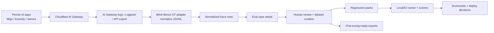

# Cloudflare-first eval architecture

Blind Bench should sit above Cloudflare AI Gateway rather than replace it. Cloudflare remains the raw model-call observability layer; Blind Bench owns eval semantics, human review, regression datasets, scorecards, and CI gates.

## Component flow



## Ownership boundaries

| Layer | Owner | Notes |
| --- | --- | --- |
| Raw request/response logs | Cloudflare AI Gateway | Source of raw model-call facts, provider/model, token/cost/latency, DLP, feedback, log IDs. |
| Trace normalization | Blind Bench | Convert heterogeneous AI Gateway exports into stable portable trace rows. |
| Eval semantics | Blind Bench | Expected behavior, scorer assignments, regression packs, review state, scorecards. |
| Pennie domain labels | Pennie-scoped Blind Bench workspace | Pennie data stays scoped to Pennie and is not generalized into reusable Blind Bench assets. |
| Scorer execution | Blind Bench local/CI runner | Deterministic by default; LLM judges behind explicit provider adapters. |
| Fine-tuning data | Pennie-scoped exports | Export only reviewed/approved examples or preference data. |

## Raw Cloudflare fields vs normalized fields

| Cloudflare / export field family | Normalized Blind Bench field |
| --- | --- |
| `account_id`, `account.id` | `source_ids.account_id` |
| `gateway_id`, `gateway.id` | `source_ids.gateway_id` |
| `log_id`, `id`, `log.id` | `source_ids.log_id` |
| `event_id`, `event.id` | `source_ids.event_id` |
| `timestamp`, `created_at`, `datetime` | `timestamp` |
| `provider` | `provider` |
| `model`, `request.model`, `response.model` | `model` |
| `status`, `response.status`, `error.type` | `status` |
| `request`, `request_body`, `payload.request` | `messages[]` plus redaction notes |
| `response`, `response_body`, `payload.response` | `output_text` plus redaction notes |
| `usage.input_tokens`, `tokens_in` | `usage.input_tokens` |
| `usage.output_tokens`, `tokens_out` | `usage.output_tokens` |
| `usage.total_tokens`, `tokens_total` | `usage.total_tokens` |
| `cost`, `cost_usd`, `usage.cost_usd` | `cost_usd` |
| `duration`, `duration_ms`, `latency_ms` | `duration_ms` |
| `cached`, `cache.cached` | `cached` |
| `dlp.action`, `dlp.flagged` | `dlp` |
| `feedback`, `human_feedback`, `feedback.rating` | `human_feedback` |
| `metadata.product` | `product` |
| `metadata.module` | `module` |
| `metadata.prompt_version` | `prompt_version` |
| `metadata.variant` | `variant` |
| `metadata.release` | `release` |
| `metadata.environment` | `environment` |

## Pennie metadata conventions

Pennie AI calls should attach metadata where possible:

```json
{
  "product": "eavesly|migo|jeeves",
  "module": "payoff_summary|qa_review|migo_summary|systems_agent",
  "prompt_version": "pv_...",
  "variant": "control|candidate|experiment_name",
  "release": "rel_...",
  "environment": "staging|production"
}
```

Recommended app-specific conventions:

- **Eavesly**: `module` should name the QA or alerting module, e.g. `disposition_review`, `qa_summary`, `manager_insights`.
- **Migo**: `module` should name the summary/chat workflow, e.g. `summary`, `tradelines`, `customer_sms`.
- **Jeeves / Pennie Systems AI**: include `module: "systems_agent"` plus sidecar metadata for harness name/version and tool policy when Cloudflare metadata is too small.

## Metadata sidecar

Cloudflare custom metadata may be too small for rich eval context. Store large or sensitive context in a Pennie-controlled sidecar keyed by one or more stable source IDs:

```text
trace_sidecar[log_id | event_id | trace_id] = {
  prompt_template_id,
  prompt_version,
  app_record_id_hash,
  harness_name,
  harness_version,
  tool_policy_id,
  reviewer_assignment,
  redaction_notes
}
```

The adapter supports a `metadataSidecar` map so normalized trace rows can merge Cloudflare metadata with Pennie-owned context without forcing everything into Cloudflare.

## Data boundaries

- Do not commit real Pennie traces, call transcripts, account data, phone numbers, emails, or secrets to the Blind Bench repo.
- Pennie-specific eval packs and reviewed examples remain Pennie-scoped.
- Reusable Blind Bench assets should be generic scorer code, schemas, docs, and synthetic examples only.
- Production traces become eval cases only after redaction/scope review.
- Fine-tuning exports should contain only reviewed/approved Pennie-scoped examples.

## Build-vs-buy

Use Cloudflare for:

- raw model-call logging
- cost/latency/provider/model metadata
- DLP and feedback fields
- Logpush/API/export plumbing
- operational cost/speed views

Use Blind Bench for:

- trace normalization
- eval-case creation
- human review
- regression datasets
- scorer assignments and execution
- JSON/Markdown scorecards
- CI gates
- fine-tuning-ready exports

Add **Braintrust** or **Langfuse** only if Blind Bench needs a borrowed observability/annotation layer that Cloudflare + the Blind Bench review workflow cannot cover. They should not become the canonical source of Pennie eval semantics by default.

## Current MVP source path

The first implemented source path is exported JSONL:

```ts
parseCloudflareAiGatewayJsonl(text)
  -> NormalizedBlindBenchTrace[]
  -> toJsonl(rows)
  -> convertTraceToEvalCase(row)
```

This is enough for Logpush/API snapshots and CI tests without live Cloudflare credentials.
